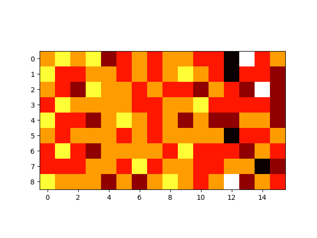

# Lab 1 Click heatmap

[](https://github.com/meyakovenkoj/DSBDA/actions/workflows/maven.yml)

## Task

#### Logic

Программа, которая строит тепловую карту кликов по странице
Входные данные: координаты нажатия x,y, userId, timestamp (справочник областей
экрана: &lt;координаты области&gt; - &lt;название области&gt;, справочник температур:
&lt;диапазон значений&gt; - &lt;температура (высокая, средняя, низкая)&gt;)
Выходные данные: название области экрана, количество нажатий (температура)

#### Output format

SequenceFile со Snappy сжатием (плюс команда просмотра содержимого сжатого
файла посредством распаковки). Приложить скриншот просмотра сжатого контента.

#### Addition

Использование Счетчиков. Приложить скриншот использования Счетчиков.

## Tests

Тесты были написаны на основное поведение программы - проверка работы Map, Reduce и MapReduce стадий. Написаны тесты на работу счетчиков. В качестве счетчиков применялось два значения - для испорченных записей MALFORMED и для общего количества задействованных секторов (для полного заполнения при разрешении 1920x1080 = 144)


## HDFS

Далее представлены скриншоты из веб-интерфейса hadoop:

JSON с координатами секторов


JSON с распределением по температуре (количество кликов)


Пример входного файла


## MapReduce Job

Так как вывод достаточно большой для MapReduce здесь приводятся основные моменты:


## Build && Deploy

**Требования к ПО и устройству**

        - Для работы с SequenceFile со Snappy сжатием необходим установленный hadoop. Данный вид сжатия работает только в hdfs. Для тестов локально был добавлен флаг `--debug`
        - Java 8
        - Maven
        - Python 3
        - Hadoop 2.8.1

В данной программе используется система сборки Maven
Для создания исполняемого пакета запускаем в `./HW1`:

```sh
mvn package
```

После успешной сборки пакета и прохождения тестов в директории `target/` появится файл `lab1-1.0-SNAPSHOT-jar-with-dependencies.jar` – пакет со всеми зависимостями

Для генерации файлов был написан скрипт на python:

```sh
python3 generator.py --help
usage: generator.py [-h] [-c C] [-x X] [-y Y] [-s S] [-real] [-live]
                    [-users USERS]

Generator of clicks on display

options:
  -h, --help    show this help message and exit
  -c C          amount of log strings
  -x X          width of display
  -y Y          height of display
  -s S          size of file
  -real         use real generate (too long)
  -live         use real mouse
  -users USERS  count of users
```

По умолчанию выставлен размер экрана в 1920х1080, в качестве размера принимается размер итогового файла как в `dd`. На выходе создается директория `input/` с тремя файлами.

Возможно задать количество логов (`-c 100`) или размер файла (`-s 10M`). Ключ `-real` говорит использовать рандомное распределение, ключ `-live` берет текщие координаты мыши (нажатие эмулируется каждые 0.01 сек)

```sh
python3 generator.py -s 100K -real
```

Для запуска в hadoop загрузим в **HDFS** сгенерированные данные

```sh
hdfs dfs -put SECTORS SECTORS
hdfs dfs -put TEMPERATURE TEMPERATURE
hdfs dfs -put input/ input
```

Для удаления используется команда:

```sh
hdfs dfs -rm -r output
```

Для запуска в псевдораспределенном режиме используется `yarn`:

```sh
yarn jar target/lab1-1.0-SNAPSHOT-jar-with-dependencies.jar input output SECTORS TEMPERATURE
```

Просмотр сжатого файла результата (SequenceFile со Snappy сжатием) можно осуществить средствами `hdfs`:

```sh
hdfs dfs -text output/p*
```


Для отладки был написан вариант и использованием простого текстового выходного файла - для этого необходимо в качестве последнего аргумента передать ключ `--debug`
Использование такого режима позволяет удобно визуализировать результат. На python был написан небольшой скрипт для отображения результатов работы программы:
Необходимые зависимости перечисленны в `requirements.txt`
Выходной файл ищется в папке `output/` в локальном хранилище (не в hdfs)

```sh
python3 plot.py
```

Пример тепловой карты:

