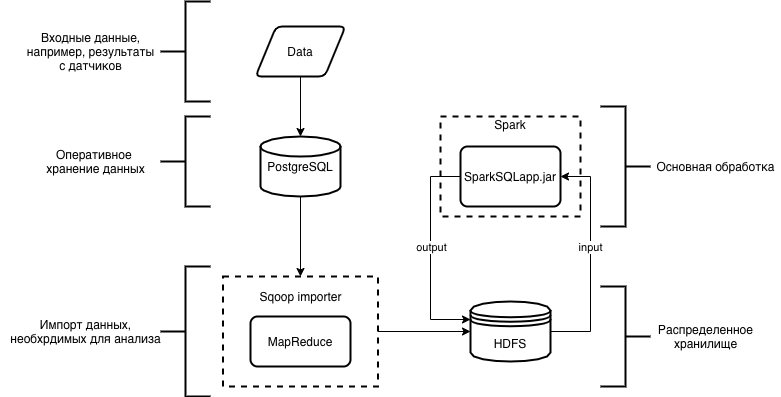
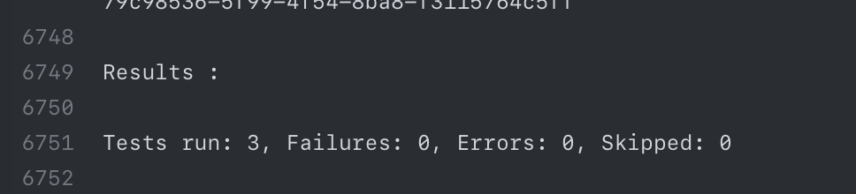
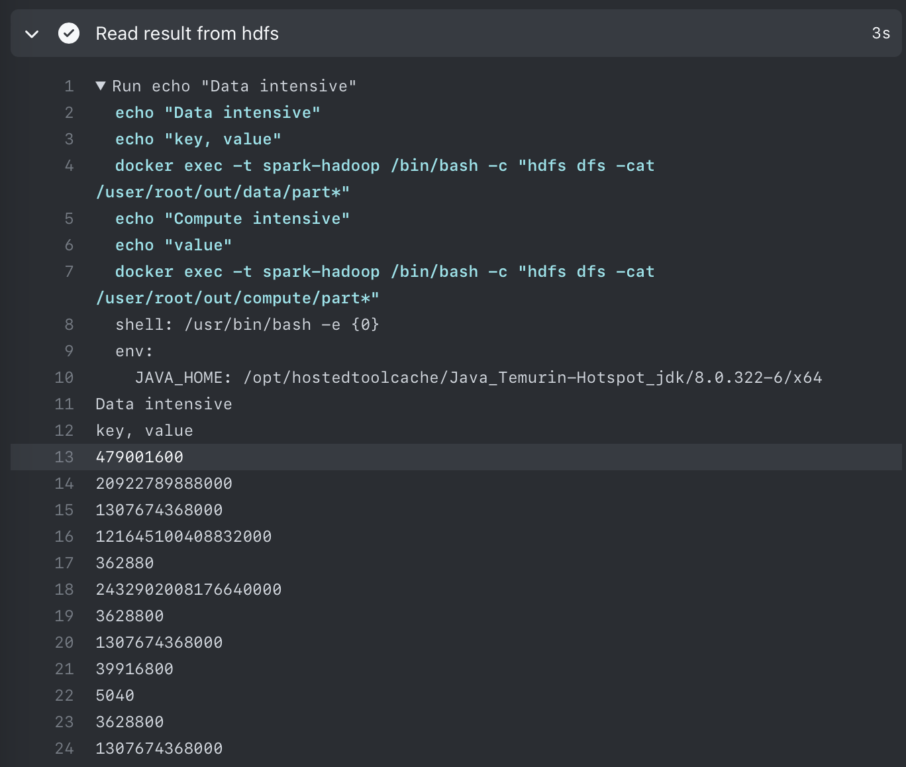
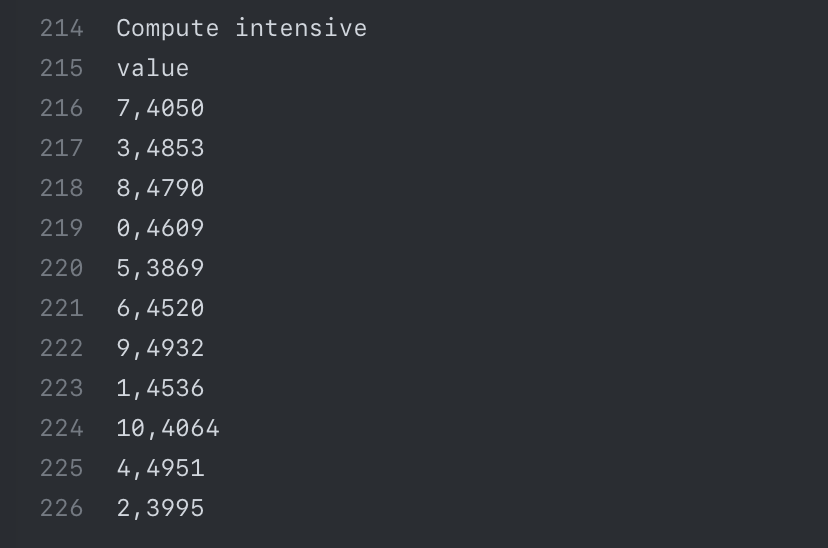
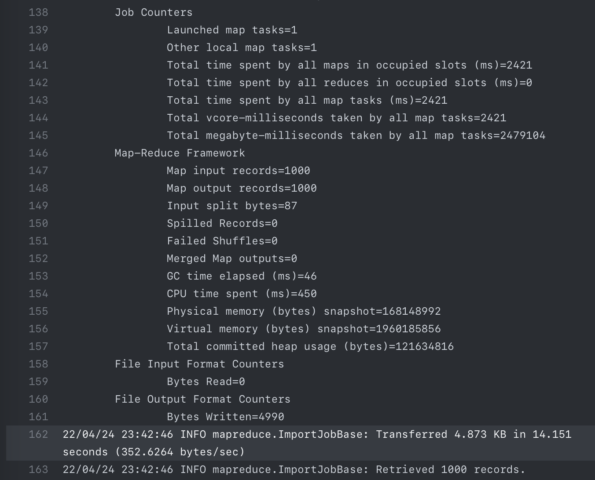
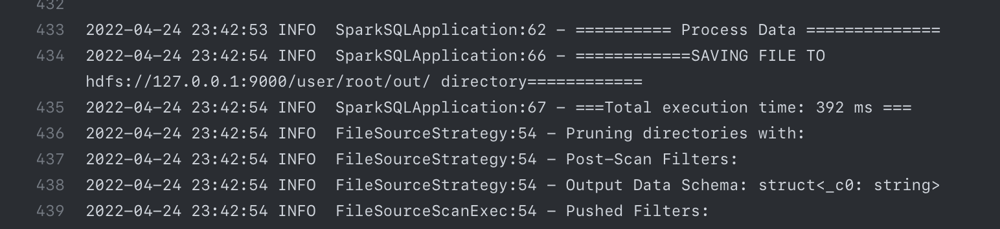

# Lab 2

[](https://github.com/meyakovenkoj/DSBDA/actions/workflows/spark.yml)

## Task

6. Программа должна эмулировать 2 типа вычислений - compute intensive (преобладают вычисления) и data intensive (преобладают операции обмена данными). В качестве референсной реализации взять: расчет больших значений факториала для элементов массива BigInteger и группировку элементов массивов по ключам каждый с каждым с редукцией суммированием (сначала генерируется сразу множество массивов, затем попарно элементы группируются по ключам, для объединенного массива выполняется редукция значений суммированием с последующей записью результата). Программа должна поддерживать возможность запуска на разном количестве данных и выполнять таймирование выполнения.

### Технология подачи новых данных

2. Sqoop importer (PostgreSQL to HDFS)

### Технология хранения

1. HDFS

### Технология обработки данных

2. Spark SQL (DataFrame, DataSet)

## Схема взаимодействия компонентов



## Тесты

Были написаны тесты на основное поведение программы. Проверена работа на задаче с упором на вычисления, и задаче с упором на передачу данных.
Данные представлены в `src/test/resources`
Запуск тестов выполнен в [GitHub Actions](https://github.com/meyakovenkoj/DSBDA/actions/workflows/spark.yml) на стадии Build with Maven



## HDFS

Чтение из hdfs выполнено на стадии Read result from hdfs




## PostgreSQL

Данные представлены в виде двух таблиц:
data_intensive:

| id | key_id | array_id | val |
|----|--------|----------|-----|
| 1  | 2      | 1        | 3   |
| 2  | 1      | 4        | 4   |
| 3  | 2      | 2        | 5   |

compute_intensive:

| id | val |
|----|-----|
| 1  | 3   |
| 2  | 4   |
| 3  | 5   |

## Sqoop

Для загрузки данных используется Sqoop.
```bash
sqoop import \
    --connect "jdbc:postgresql://db:5432/$POSTGRES_DB?ssl=false" \
    --username "$POSTGRES_USER" --password "$POSTGRES_PASSWORD" \
    --target-dir 'compute_intensive' \
    --query "select val from compute_intensive where \$CONDITIONS" -m 1
```

Загрузка 1000 строк:



## Spark SQL

Приложение содержит две стадии. Запуск задачи с нагрузкой на вычисления и задачи с нагрузкой на передачу данных. Выполнено таймирование выполения подсчетов



## Build && Deploy

**Требования к ПО и устройству**

        - Java 8
        - Maven
        - Python 3
        - Hadoop 2.8.1
        - Sqoop 1.4.7
        - Spark 2.3.1
        - PostgreSQL 10.5

В директории `./HW2` запускаем Maven

```sh
mvn -B package --file pom.xml
```

После успешной сборки пакета и прохождения тестов в директории `target/` появится файл `lab2-1.0-SNAPSHOT-jar-with-dependencies.jar` – пакет со всеми зависимостями

Для генерации файлов был написан скрипт на python:
```sh
python3 generator.py --help
usage: generator.py [-h] [-c C] [-max MAX] [-len LEN] [-db DB] [-debug] [-auto]

Generator of clicks on display

optional arguments:
  -h, --help  show this help message and exit
  -c C        amount of arrays
  -max MAX    max of value generation
  -len LEN    size of arrays
  -db DB      name of database
  -debug      use debug mode
  -auto       use auto load mode
```

Результатом скрипта является создание `dump.sql`

Для тестов использовался docker-compose

в директории ./HW2/docker:
`docker-compose up -d --build`

затем запуск скрипта:
```docker exec -t spark-hadoop /bin/bash -c "/root/start.sh com.yakovenko.lab2.SparkSQLApplication SparkSQLApplication lab2-1.0-SNAPSHOT-jar-with-dependencies.jar"```

После этого можно выполнить чтение данных из hdfs:

```sh
echo "Data intensive"
echo "key, value"
docker exec -t spark-hadoop /bin/bash -c "hdfs dfs -cat /user/root/out/data/part*"
echo "Compute intensive"
echo "value"
docker exec -t spark-hadoop /bin/bash -c "hdfs dfs -cat /user/root/out/compute/part*"
```


