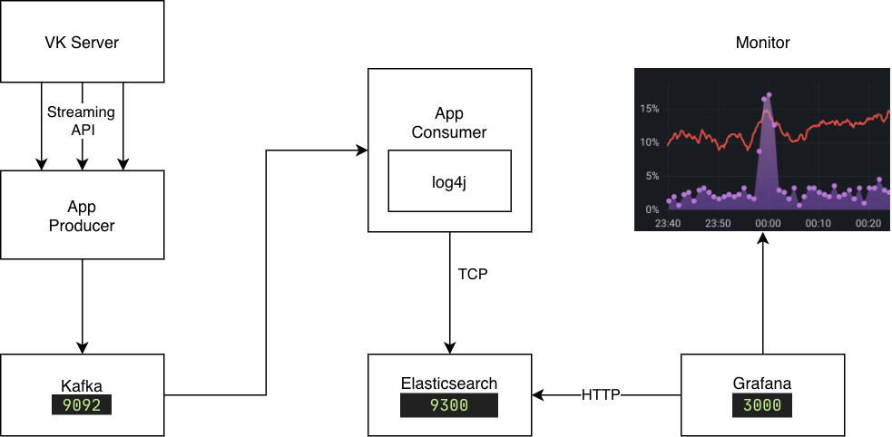
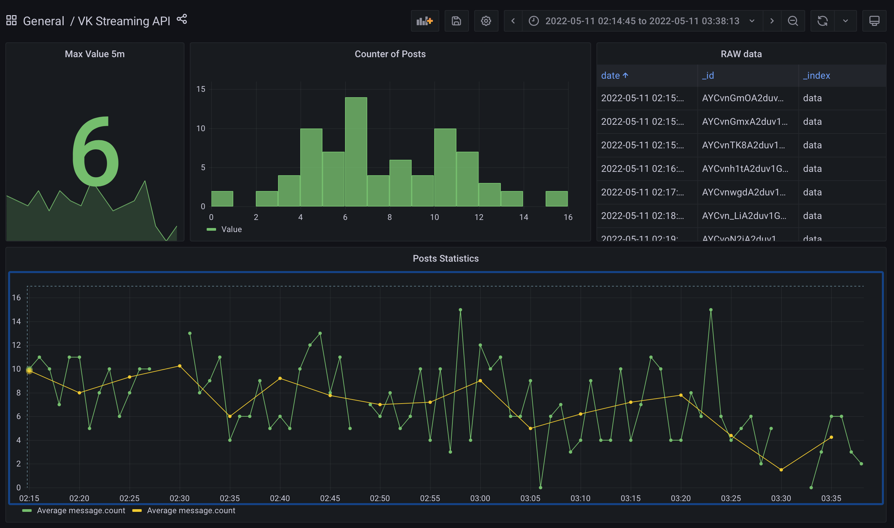

# Lab 3

[](https://github.com/meyakovenkoj/DSBDA/actions/workflows/stream-api.yml)

## Task

Для любого доступного публичного stream API (например, https://www.quora.com/Where-can-I-find-public-or-free-real-time-or-streaming-data-sources ) написать программу, которая вычисляет количество некоторых событий (метрик, сообщений и т.д) поминутно и отправляет агрегированные данные в Elasticsearch (count/timeline graph).

## Deploy

Ubuntu Dockerfile с bash-скриптами настройки окружения

## Delivery to Elasticsearch

log4j async or any http appender

## Visualization

Grafana

### System diagram



## Usage

Set app ID and Service token in env:

```
export APPID=xxx
export TOKEN=xxx
```

Start getting messages from VK Streaming API:

```bash
curl --location --request POST 'http://localhost:8080/start' \
--header 'Content-Type: application/x-www-form-urlencoded' \
--data-urlencode "appId=$APPID" \
--data-urlencode "token=$TOKEN"
```

Example of elasticsearch data:

```json
{
  "_index": "data",
  "_type": "response",
  "_id": "AYCGz9-z3strKRoAcmIa",
  "_version": 1,
  "found": true,
  "_source": {
    "date": "2022-05-03T01:06:51,794",
    "thread": "[scheduled-executor-thread-1]",
    "level": "INFO ",
    "logger": "HTTP_APPENDER",
    "message": {
      "count": 3,
      "eventUrls": [
        "https://vk.com/wall-196735535_1298?reply\u003d1302",
        "https://vk.com/wall-21306134_14164",
        "https://vk.com/wall-210828502_49?reply\u003d105\u0026thread\u003d51"
      ]
    }
  }
}
```

In grafana:



Приложение отображает поминутную статистику записей и постов в социальной сети ВК. Для образовательных целей доступено только 1% данных, однако и это количество позволяет получить некоторую картину использования социальной сети.

Для получения информации от сервера используется Streaming API. Данные поступают в приложение-клиент(producer) и отправляются в Kafka. Другое приложение(client) читает данные от брокера и с использованием http-appender в Log4j пишет данные в elasticsearch для последующей визуализации в Grafana.

Основные сервисы размещены в контейнерах докера, за исключением java приложений. Их сборка в контейнере слишком медленная, однако запуск так же можно выполнить внутри контейнера.

## Build && Deploy

**Требования к ПО и устройству**

        - Java 17
        - Maven
        - docker

В директории `./HW3` запускаем находится скрипт настройки

```sh
bash deploy.sh
```

После успешной сборки приложений и прохождения тестов в директории будет выведено следующее сообщение:

```
Run:
- VK client with command:
        cd producer && ./mvnw mn:run

- Kafka client with command:
        java -cp consumer/target/lab3-1.0-SNAPSHOT-jar-with-dependencies.jar \
        com.yakovenko.lab3.ConsumerLogger streaming-analytics

- Send token with:
        curl --location --request POST 'http://localhost:8080/start' \
        --header 'Content-Type: application/x-www-form-urlencoded' \
        --data-urlencode "appId=$APPID" \
        --data-urlencode "token=$TOKEN"

- Open browser on http://localhost:3000
```
