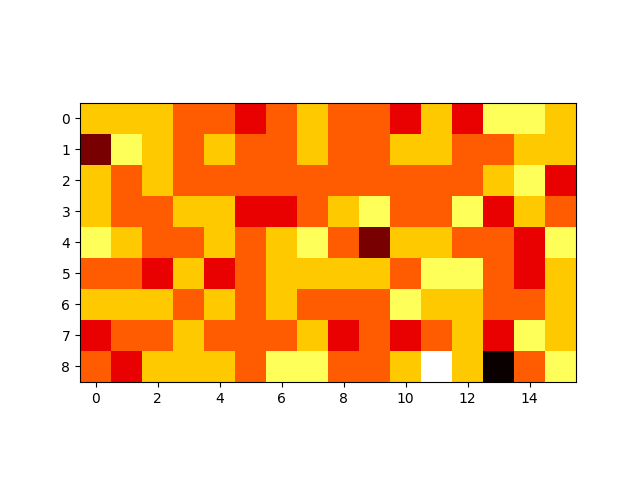

# DSBDA
Repository for Data Science and Big Data Analytics

## Structure
There will be some homeworks for this course and instructions for building and testing for each of them.

# Homework 1 - Click-map

Exmaple of heatmap using urandom for generate clicks on the screen

